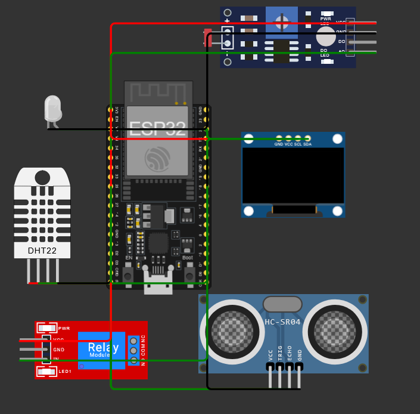
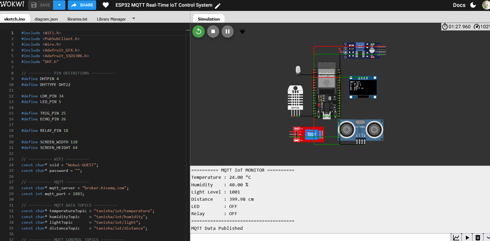
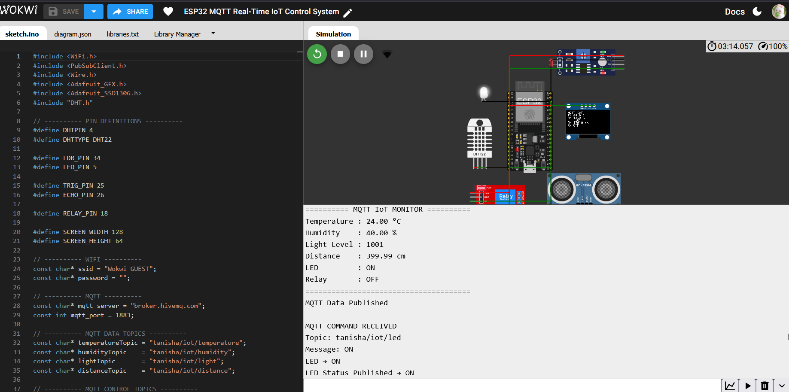
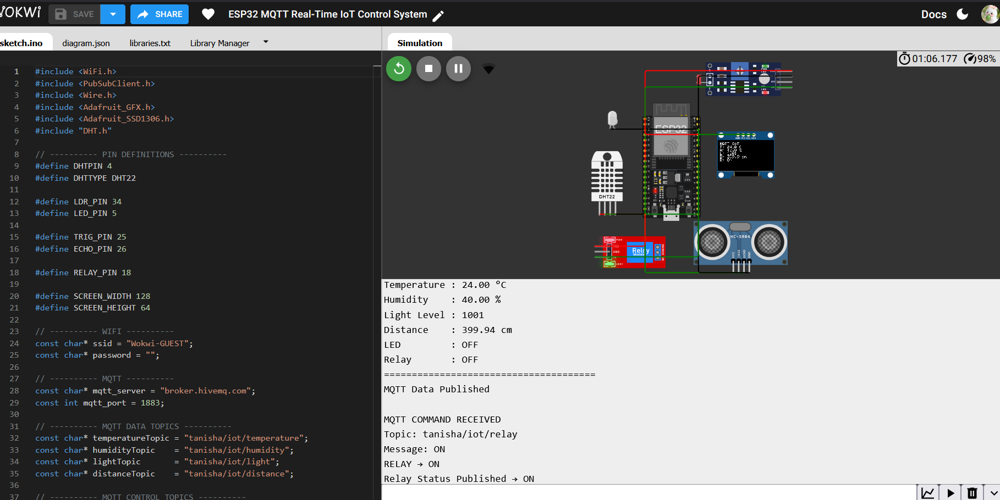

# ESP32 MQTT Real-Time IoT Control System

An ESP32-based real-time IoT system that uses **MQTT communication** for sensor monitoring, remote actuator control, and status feedback.

The project demonstrates two-way communication between an ESP32 device and an MQTT client through a public MQTT broker.

---

## 📌 Project Overview

This project extends the previous ESP32 cloud-monitoring work by introducing **MQTT-based real-time communication**.

The ESP32:

* Reads temperature and humidity using DHT22
* Monitors light intensity using an LDR
* Measures distance using an HC-SR04 ultrasonic sensor
* Displays sensor information on an OLED
* Publishes sensor data through MQTT
* Receives remote commands through MQTT
* Controls an LED and relay remotely
* Publishes actuator status feedback through MQTT

---

## 🚀 Features

* 📡 Wi-Fi connectivity using ESP32
* 🔄 Real-time MQTT communication
* 🌡️ Temperature monitoring
* 💧 Humidity monitoring
* 💡 Light-level monitoring
* 📏 Distance measurement
* 🖥️ OLED display
* 💡 Remote LED control
* 🔌 Remote relay control
* 📤 MQTT sensor-data publishing
* 📥 MQTT command receiving
* 🔁 LED and relay status feedback
* 🔄 Automatic MQTT reconnection

---

## 🧠 MQTT Architecture

```text
             ┌─────────────────────┐
             │      MQTTX          │
             │  Control / Monitor  │
             └──────────┬──────────┘
                        │
                  MQTT Messages
                        │
                        ▼
             ┌─────────────────────┐
             │    MQTT Broker      │
             │   HiveMQ Public     │
             └──────────┬──────────┘
                        │
                        ▼
             ┌─────────────────────┐
             │       ESP32         │
             │                     │
             │ DHT22  ──────────┐  │
             │ LDR    ──────────┤  │
             │ HC-SR04 ─────────┤  │
             │ OLED   ──────────┤  │
             │ LED    ──────────┤  │
             │ Relay  ──────────┘  │
             └─────────────────────┘
```

---

## 🔧 Hardware Components

| Component           | Purpose                          |
| ------------------- | -------------------------------- |
| ESP32 DevKit C V4   | Main controller                  |
| DHT22               | Temperature and humidity sensing |
| LDR / Photoresistor | Light-level sensing              |
| HC-SR04             | Distance measurement             |
| SSD1306 OLED        | Local sensor display             |
| LED                 | MQTT-controlled output           |
| Relay Module        | MQTT-controlled actuator         |

---

## 📌 Pin Configuration

| Component         | ESP32 GPIO |
| ----------------- | ---------: |
| DHT22 Data        |     GPIO 4 |
| LDR Analog Output |    GPIO 34 |
| LED               |     GPIO 5 |
| HC-SR04 TRIG      |    GPIO 25 |
| HC-SR04 ECHO      |    GPIO 26 |
| OLED SDA          |    GPIO 21 |
| OLED SCL          |    GPIO 22 |
| Relay IN          |    GPIO 18 |

---

## 📡 MQTT Configuration

### MQTT Broker

```text
Broker: broker.hivemq.com
Port: 1883
Protocol: MQTT
```

### Sensor Data Topics

```text
tanisha/iot/temperature
tanisha/iot/humidity
tanisha/iot/light
tanisha/iot/distance
```

### Control Topics

```text
tanisha/iot/led
tanisha/iot/relay
```

### Status Topics

```text
tanisha/iot/led/status
tanisha/iot/relay/status
```

---

## 🔄 Communication Flow

### Sensor Data Publishing

```text
DHT22 / LDR / HC-SR04
          ↓
        ESP32
          ↓
     MQTT Broker
          ↓
       MQTTX
```

### Remote Control

```text
MQTTX
   ↓
MQTT Broker
   ↓
ESP32
   ↓
LED / Relay
```

### Status Feedback

```text
LED / Relay
     ↓
   ESP32
     ↓
MQTT Broker
     ↓
   MQTTX
```

---

## 🧪 Example MQTT Commands

### Turn LED ON

**Topic**

```text
tanisha/iot/led
```

**Payload**

```text
ON
```

### Turn LED OFF

**Payload**

```text
OFF
```

### Turn Relay ON

**Topic**

```text
tanisha/iot/relay
```

**Payload**

```text
ON
```

### Turn Relay OFF

**Payload**

```text
OFF
```

---

## 🖥️ Example Serial Output

```text
WiFi Connected!
IP Address: 10.10.0.2

--------------------------------
ESP32 MQTT IoT SYSTEM
--------------------------------

MQTT Connected!
Subscribed to control topics.

========== MQTT IoT MONITOR ==========

Temperature : 24.00 °C
Humidity    : 40.00 %
Light Level : 1001
Distance    : 399.98 cm
LED         : OFF
Relay       : OFF

======================================

MQTT Data Published
```

### Remote LED Control

```text
MQTT COMMAND RECEIVED

Topic: tanisha/iot/led
Message: ON

LED → ON
LED Status Published → ON
```

### Remote Relay Control

```text
MQTT COMMAND RECEIVED

Topic: tanisha/iot/relay
Message: ON

RELAY → ON
Relay Status Published → ON
```

---

## 📸 Project Screenshots

### Wokwi Circuit



### Serial Monitor



### MQTT LED Control



### MQTT Relay Control



---

## 🛠️ Software & Libraries

* Arduino IDE / Wokwi
* ESP32
* MQTT
* PubSubClient
* DHT Sensor Library
* Adafruit GFX Library
* Adafruit SSD1306
* WiFi Library

---

## 📚 Key Concepts Learned

Through this project, I learned and implemented:

* MQTT architecture
* MQTT broker
* Publisher and subscriber model
* MQTT topics
* MQTT callbacks
* Real-time messaging
* Remote actuator control
* Status feedback
* ESP32 Wi-Fi networking
* Sensor-data publishing
* MQTT reconnection handling

---

## 🔐 Note

This project uses the public HiveMQ MQTT broker for learning and demonstration purposes. No authentication credentials are used.

For a production IoT system, a private broker with authentication, authorization, TLS encryption, and unique topic namespaces should be used.

---

## 🎯 Project Outcome

This project demonstrates a complete **two-way IoT communication system** where an ESP32 can both publish sensor information and receive remote commands through MQTT.

It represents the transition from basic sensor-based IoT projects toward **real-time connected IoT systems**.

---

## 👩‍💻 Author

**Tanisha Karan**

B.Tech — Computer Science / Internet of Things

Exploring IoT, Embedded Systems, MQTT, ESP32 and connected technologies.
